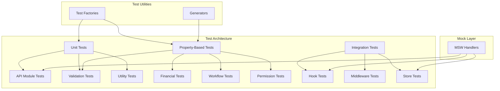

# Design Document

## Overview

Bu tasarım, Dernek Yönetim Sistemi'nin kod kalitesini artırmak ve test coverage'ı %70 hedefine ulaştırmak için gerekli test stratejisini ve mimari kararları tanımlar. Mevcut durumda coverage %58 civarında olup, özellikle `lib/appwrite/api` modülleri (%5-7) ve `lib/utils` (%12.5) düşük coverage'a sahiptir.

## Architecture



## Components and Interfaces

### 1. Test Factory System

```typescript
// src/__tests__/test-utils/factories.ts
interface TestFactory<T> {
  build(overrides?: Partial<T>): T;
  buildList(count: number, overrides?: Partial<T>): T[];
}

// Factories for each domain entity
export const beneficiaryFactory: TestFactory<BeneficiaryDocument>;
export const donationFactory: TestFactory<DonationDocument>;
export const userFactory: TestFactory<UserDocument>;
export const taskFactory: TestFactory<TaskDocument>;
export const meetingFactory: TestFactory<MeetingDocument>;
```

### 2. Property-Based Test Generators

```typescript
// src/__tests__/test-utils/generators.ts
import { fc } from '@fast-check/vitest';

export const validTcKimlikNo: fc.Arbitrary<string>;
export const validPhoneNumber: fc.Arbitrary<string>;
export const validEmail: fc.Arbitrary<string>;
export const validCurrency: fc.Arbitrary<'TRY' | 'USD' | 'EUR'>;
export const validBeneficiaryStatus: fc.Arbitrary<BeneficiaryStatus>;
export const validAmount: fc.Arbitrary<number>;
```

### 3. Mock Service Worker Handlers

```typescript
// src/__tests__/mocks/handlers.ts
export const appwriteHandlers = [
  // Collection CRUD handlers
  http.get('/v1/databases/:dbId/collections/:collId/documents', handler),
  http.post('/v1/databases/:dbId/collections/:collId/documents', handler),
  http.patch('/v1/databases/:dbId/collections/:collId/documents/:docId', handler),
  http.delete('/v1/databases/:dbId/collections/:collId/documents/:docId', handler),
];
```

## Data Models

### Test Data Structures

```typescript
interface MockAppwriteResponse<T> {
  total: number;
  documents: T[];
}

interface MockErrorResponse {
  code: number;
  message: string;
  type: string;
}

interface TestContext {
  user: UserDocument | null;
  permissions: PermissionValue[];
  isAuthenticated: boolean;
}
```

## Correctness Properties

*A property is a characteristic or behavior that should hold true across all valid executions of a system-essentially, a formal statement about what the system should do. Properties serve as the bridge between human-readable specifications and machine-verifiable correctness guarantees.*

### Property 1: CRUD Error Response Consistency
*For any* API call that fails, the error response SHALL have a consistent structure with `success: false`, `error: string`, and optional `code: string` fields.
**Validates: Requirements 1.3**

### Property 2: Zod Schema Parse-Serialize Round Trip
*For any* valid data object, serializing to JSON and parsing back through the Zod schema SHALL produce an equivalent object.
**Validates: Requirements 2.2**

### Property 3: Validation Error Detail Completeness
*For any* invalid input to a Zod schema, the error response SHALL include the field path and a human-readable error message.
**Validates: Requirements 2.1**

### Property 4: Permission Check Correctness
*For any* user with a set of permissions P, `hasPermission(p)` SHALL return true if and only if p ∈ P.
**Validates: Requirements 3.3**

### Property 5: Permission Composition Correctness
*For any* user with permissions P and permission set S, `hasAnyPermission(S)` SHALL return true if and only if P ∩ S ≠ ∅, and `hasAllPermissions(S)` SHALL return true if and only if S ⊆ P.
**Validates: Requirements 3.3**

### Property 6: Logout State Clearing
*For any* authenticated user state, after logout, the authStore SHALL have `user: null`, `session: null`, `isAuthenticated: false`.
**Validates: Requirements 3.2**

### Property 7: Memoization Idempotence
*For any* memoized function f and input x, calling f(x) multiple times SHALL return the same cached result.
**Validates: Requirements 4.2**

### Property 8: Workflow State Machine Validity
*For any* beneficiary with status S, only transitions defined in the state machine SHALL be allowed.
**Validates: Requirements 5.1**

### Property 9: Workflow Transition Determinism
*For any* beneficiary data and transition attempt, the workflow engine SHALL produce the same result for identical inputs.
**Validates: Requirements 5.2**

### Property 10: Financial Calculation Precision
*For any* financial calculation involving amounts, the result SHALL be accurate to 2 decimal places (no floating point errors).
**Validates: Requirements 6.1**

### Property 11: Financial Aggregation Consistency
*For any* list of financial records, the aggregate total SHALL equal the sum of individual amounts.
**Validates: Requirements 6.3**

### Property 12: Rate Limit Enforcement
*For any* request pattern exceeding the configured limit (100 req/15min), subsequent requests SHALL receive 429 status.
**Validates: Requirements 7.1**

### Property 13: CSRF Token Validation
*For any* mutating request (POST/PUT/PATCH/DELETE) without valid CSRF token, the request SHALL be rejected with 403 status.
**Validates: Requirements 7.2**

### Property 14: Authentication Enforcement
*For any* request to a protected endpoint without valid session, the request SHALL be rejected with 401 status.
**Validates: Requirements 7.3**

### Property 15: Offline Mutation Queuing
*For any* mutation attempted while offline, the mutation SHALL be added to the offline queue with correct metadata.
**Validates: Requirements 8.3**

## Error Handling

### Test Error Categories

| Error Type | Handling Strategy | Test Approach |
|------------|-------------------|---------------|
| Validation Error | Return detailed field errors | Property test with invalid inputs |
| API Error | Return consistent error structure | Mock error responses |
| Network Error | Queue for offline sync | Simulate offline mode |
| Permission Error | Return 403 with message | Test with various permission sets |
| Rate Limit Error | Return 429 with retry-after | Simulate rapid requests |

## Testing Strategy

### Property-Based Testing Library

**Selected Library:** `@fast-check/vitest` - Native Vitest integration with fast-check for property-based testing.

### Test Organization

```
src/__tests__/
├── api/                    # API route tests (existing)
├── components/             # Component tests (existing)
├── hooks/                  # Hook tests (existing)
├── lib/
│   ├── api/               # API utility tests
│   ├── appwrite/          # Appwrite wrapper tests (NEW)
│   ├── validations/       # Validation schema tests (EXPAND)
│   └── utils/             # Utility function tests (EXPAND)
├── properties/            # Property-based tests (NEW)
│   ├── validation.property.ts
│   ├── permissions.property.ts
│   ├── workflow.property.ts
│   ├── financial.property.ts
│   └── middleware.property.ts
├── stores/                # Store tests (EXPAND)
├── mocks/                 # MSW handlers (EXPAND)
└── test-utils/
    ├── factories.ts       # Test data factories (NEW)
    ├── generators.ts      # PBT generators (NEW)
    └── index.ts           # Test utilities
```

### Dual Testing Approach

1. **Unit Tests**: Verify specific examples, edge cases, and error conditions
2. **Property-Based Tests**: Verify universal properties that should hold across all inputs

### Test Configuration

```typescript
// Property test configuration
const PBT_CONFIG = {
  numRuns: 100,           // Minimum 100 iterations per property
  seed: Date.now(),       // Reproducible with seed
  verbose: true,          // Show counterexamples
};
```

### Coverage Targets by Module

| Module | Current | Target | Priority |
|--------|---------|--------|----------|
| lib/appwrite/api | 5% | 70% | High |
| lib/utils | 12.5% | 70% | High |
| lib/validations | 70% | 80% | Medium |
| stores | 60% | 75% | Medium |
| lib/auth | 62% | 75% | Medium |
| lib/financial | 60% | 75% | Medium |
| lib/beneficiary | 74% | 80% | Low |
