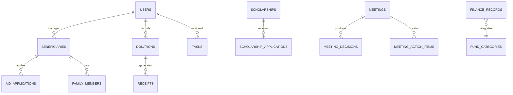

# Dernek Yönetim Sistemi (KAFKASDER) - PRD

## Ürün Genel Bakış

**KAFKASDER Dernek Yönetim Sistemi**, sivil toplum kuruluşlarının (STK) operasyonel süreçlerini dijitalleştiren kapsamlı bir yönetim platformudur. Sistem, yardım alıcı takibi, bağış yönetimi, burs programları, finansal raporlama ve paydaş iletişimi gibi kritik fonksiyonları tek bir platformda birleştirir.

### Hedef Kullanıcılar

| Rol | Açıklama |
|-----|---------|
| **Super Admin** | Tam sistem erişimi, tüm modüller üzerinde CRUD yetkisi |
| **Admin** | Kullanıcı yönetimi hariç tüm modüllere erişim |
| **Staff** | Günlük operasyonlar: yardım alıcı, bağış, görev yönetimi |
| **Volunteer** | Sınırlı erişim: atanmış görevler ve temel bilgiler |

---

## Modüller ve Özellikler

### 1. Yardım Alıcı Yönetimi (Beneficiaries)

```
├── Yardım alıcı kaydı ve profil yönetimi
├── TC Kimlik No doğrulama
├── Aile üyesi ekleme/yönetimi
├── Adres ve iletişim bilgileri
├── Sosyal durum değerlendirmesi
├── Yardım geçmişi takibi
├── Belge yönetimi (evraklar, fotoğraflar)
└── Filtreleme ve arama (şehir, durum, kategori)
```

**API Endpoints:** `/api/beneficiaries`, `/api/beneficiaries/[id]`, `/api/beneficiaries/[id]/family`

---

### 2. Bağış Yönetimi (Donations)

```
├── Bağış kaydı (nakit, ayni, online)
├── Bağışçı profili oluşturma
├── Makbuz oluşturma ve yazdırma
├── Kurban/Fitre/Zekat kampanyaları
├── Banka hesap entegrasyonu
├── Düzenli bağış takibi
├── Bağış analitikleri ve raporlama
└── Bağış kategorileri yönetimi
```

**API Endpoints:** `/api/donations`, `/api/donations/[id]`, `/api/donations/receipts`, `/api/donations/campaigns`

---

### 3. Burs Programları (Scholarships)

```
├── Burs başvurusu alma
├── Başvuru değerlendirme süreci
├── Öğrenci takibi
├── Ödeme planlaması
├── Akademik başarı takibi
├── Burs kategorileri (ilkokul, lise, üniversite)
└── Burs raporları
```

**API Endpoints:** `/api/scholarships`, `/api/scholarships/applications`, `/api/scholarships/applications/[id]`

---

### 4. Finansal Yönetim (Finance)

```
├── Gelir/gider kaydı
├── Fon yönetimi (bağış, kurban, fitre, zekat)
├── Banka hesapları
├── Nakit akışı takibi
├── Bütçe planlama
├── Finansal raporlar
├── Kumbara sistemi
└── Vergi raporları
```

**API Endpoints:** `/api/finance`, `/api/kumbara`, `/api/financial`

---

### 5. Toplantı Yönetimi (Meetings)

```
├── Toplantı planlama
├── Katılımcı davetleri
├── Gündem oluşturma
├── Karar kayıtları
├── Görev atamaları
├── Toplantı notları
└── Hatırlatıcılar
```

**API Endpoints:** `/api/meetings`, `/api/meeting-action-items`, `/api/meeting-decisions`

---

### 6. Görev Yönetimi (Tasks & Todos)

```
├── Görev oluşturma ve atama
├── Öncelik belirleme
├── Durum takibi (pending, in-progress, done)
├── Son tarih yönetimi
├── Kişisel todo listesi
├── Drag & drop sıralama
└── Bildirimler
```

**API Endpoints:** `/api/tasks`, `/api/todos`

---

### 7. Mesajlaşma ve İletişim (Messages)

```
├── Dahili mesajlaşma
├── Toplu SMS gönderimi
├── Email şablonları
├── Bildirim merkezi
├── İletişim kayıtları
└── Mesaj arşivi
```

**API Endpoints:** `/api/messages`, `/api/communication`, `/api/notifications`

---

### 8. Partner/Paydaş Yönetimi

```
├── Kurumsal partnerler
├── Bireysel bağışçılar
├── Tedarikçiler
├── Gönüllü koordinasyonu
├── İşbirliği geçmişi
└── Katkı raporları
```

**API Endpoints:** `/api/partners`, `/api/partners/[id]`

---

### 9. Kullanıcı ve Yetki Yönetimi

```
├── Kullanıcı oluşturma/düzenleme
├── Rol tabanlı erişim kontrolü (RBAC)
├── İki faktörlü doğrulama (2FA)
├── Oturum yönetimi
├── Şifre politikaları
├── Aktivite logları
└── Hesap kilitleme
```

**API Endpoints:** `/api/users`, `/api/auth/*`

---

### 10. Ayarlar ve Yapılandırma

```
├── Genel sistem ayarları
├── Tema/görünüm ayarları
├── Email SMTP yapılandırması
├── SMS gateway ayarları
├── Güvenlik politikaları
├── Yedekleme ayarları
└── Entegrasyon yönetimi
```

**API Endpoints:** `/api/settings/*`, `/api/branding`

---

### 11. Raporlama ve Analitik

```
├── Dashboard metrikleri
├── Finansal raporlar
├── Yardım dağıtım raporları
├── Bağışçı analizi
├── Performans göstergeleri
├── Export (Excel, PDF)
└── Özel rapor oluşturucu
```

**API Endpoints:** `/api/analytics`, `/api/dashboard`

---

### 12. Denetim ve Güvenlik

```
├── Denetim kayıtları (Audit Logs)
├── Hata takip sistemi
├── Güvenlik olayları
├── CSRF koruması
├── Rate limiting
├── XSS önleme
└── Session güvenliği
```

**API Endpoints:** `/api/audit-logs`, `/api/errors`, `/api/security`

---

## Teknik Mimari

### Frontend Stack

| Teknoloji | Versiyon | Kullanım |
|-----------|----------|----------|
| Next.js | 16.x | App Router, SSR/SSG |
| React | 19.2 | UI Framework |
| TypeScript | 5.x | Type Safety |
| Tailwind CSS | 4.x | Styling |
| Radix UI | Latest | Accessible Components |
| Zustand | 5.x | State Management |
| React Query | 5.x | Server State |
| React Hook Form | 7.x | Form Handling |
| Zod | 4.x | Validation |

### Backend Stack

| Teknoloji | Kullanım |
|-----------|----------|
| Appwrite | BaaS (Database, Auth, Storage, Realtime) |
| Node.js | 20.x Runtime |
| node-appwrite | Server SDK |

### Güvenlik Özellikleri

- ✅ CSRF Token koruması
- ✅ Rate Limiting (endpoint bazlı)
- ✅ XSS önleme (DOMPurify)
- ✅ HttpOnly Cookies
- ✅ Security Headers (CSP, HSTS, X-Frame-Options)
- ✅ Input Validation (Zod)
- ✅ 2FA Desteği (TOTP)

---

## Veri Modelleri (Koleksiyonlar)



### Ana Koleksiyonlar

| Koleksiyon | Açıklama |
|------------|---------|
| `users` | Sistem kullanıcıları |
| `beneficiaries` | Yardım alıcılar |
| `donations` | Bağış kayıtları |
| `scholarships` | Burs programları |
| `scholarship_applications` | Burs başvuruları |
| `finance_records` | Gelir/gider kayıtları |
| `meetings` | Toplantılar |
| `meeting_decisions` | Toplantı kararları |
| `tasks` | Görevler |
| `todos` | Kişisel yapılacaklar |
| `messages` | Mesajlar |
| `notifications` | Bildirimler |
| `partners` | Partnerler |
| `errors` | Hata kayıtları |
| `audit_logs` | Denetim logları |
| `system_settings` | Sistem ayarları |

---

## API Yapısı

### Genel Endpoint Sayısı: **35+ modül, 100+ endpoint**

### Yetkilendirme Seviyeleri

| Seviye | Açıklama |
|--------|---------|
| `public` | Kimlik doğrulama gerektirmez |
| `authenticated` | Giriş yapmış kullanıcı |
| `staff+` | Staff, Admin, Super Admin |
| `admin+` | Admin, Super Admin |
| `super_admin` | Yalnızca Super Admin |

### Rate Limiting

| Tip | Limit |
|----|-------|
| Read operations | 100 req/min |
| Write operations | 30 req/min |
| Auth endpoints | 10 req/min |
| Error reporting | 20 req/min |

---

## UI/UX Bileşenleri

### Sayfa Sayısı: **15+ ana modül sayfası**

| Modül | Sayfalar |
|-------|---------|
| Yardım Alıcılar | Liste, Detay, Form, Aile |
| Bağışlar | Liste, Detay, Form, Kampanya |
| Burslar | Liste, Başvurular, Detay |
| Finans | Dashboard, Gelir/Gider, Raporlar |
| Toplantılar | Liste, Detay, Kararlar |
| Görevler | Kanban, Liste |
| Mesajlar | Inbox, Compose, Templates |
| Ayarlar | Genel, Güvenlik, Tema, Entegrasyon |
| Analitik | Dashboard, Raporlar |

### UI Bileşen Kütüphanesi: **81 UI component**

- Button, Input, Select, Checkbox, Radio
- Dialog, Sheet, Drawer, Popover
- Table, DataTable, Pagination
- Card, Accordion, Tabs
- Toast, Alert, Badge
- Calendar, DatePicker
- Charts (Recharts)
- Form components
- Navigation components

---

## Performans Hedefleri

| Metrik | Hedef |
|--------|-------|
| First Contentful Paint (FCP) | < 1.5s |
| Largest Contentful Paint (LCP) | < 2.5s |
| Time to Interactive (TTI) | < 3.5s |
| Cumulative Layout Shift (CLS) | < 0.1 |
| Bundle Size (gzipped) | < 200KB |
| Test Coverage | > 70% |

---

## Gelecek Özellikler (Roadmap)

### P1 - Kısa Vadeli

- [ ] Mobil uygulama (React Native / PWA)
- [ ] Gelişmiş raporlama modülü
- [ ] SMS entegrasyonu
- [ ] Otomatik yedekleme

### P2 - Orta Vadeli

- [ ] Multi-tenant desteği
- [ ] API documentation (Swagger)
- [ ] Webhook desteği
- [ ] Gelişmiş workflow engine

### P3 - Uzun Vadeli

- [ ] AI destekli öneriler
- [ ] Blockchain tabanlı bağış izleme
- [ ] Çoklu dil desteği
- [ ] White-label çözümü

---

## Sonuç

KAFKASDER Dernek Yönetim Sistemi, STK'ların tüm operasyonel ihtiyaçlarını karşılayacak şekilde tasarlanmış, modern teknolojilerle geliştirilmiş kapsamlı bir platformdur. Next.js 16 ve React 19 ile güçlü bir frontend, Appwrite ile esnek bir backend altyapısı sunmaktadır.

**Toplam:**
- 🔹 **35+ API modülü**
- 🔹 **100+ endpoint**
- 🔹 **15+ dashboard sayfası**
- 🔹 **81 UI bileşeni**
- 🔹 **18 lib modülü**
- 🔹 **4 state store**
