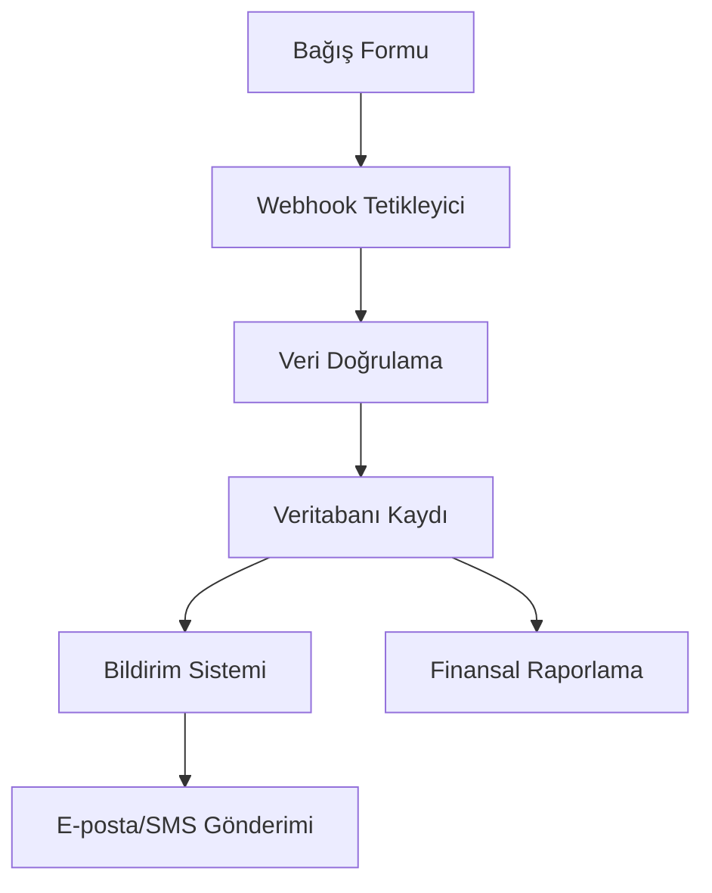

# N8N Bağış Yönetimi Otomasyon Sistemi Tasarımı

## Sistem Mimarisi



## Veri Akışı ve İş Kuralları

### 1. Bağış Alma Süreci
- **Tetikleyici**: Webhook (bağış formu gönderimi)
- **Veri Doğrulama**:
  - Zorunlu alanların doldurulması
  - Geçerli e-posta/telefon formatı
  - Bağış tutarının geçerliliği
- **Veritabanı İşlemleri**:
  - Yeni bağış kaydı oluşturma
  - Bağışçı bilgilerini güncelleme
  - Finansal kayıtları güncelleme

### 2. Bildirim Süreci
- **Koşullar**:
  - Başarılı bağış kaydı
  - Belirli tutar eşiklerini aşma
- **Eylemler**:
  - E-posta bildirimi gönderimi
  - SMS bildirimi gönderimi
  - İç sistem bildirimi oluşturma

### 3. Raporlama Süreci
- **Zamanlama**: Günlük/haftalık/aylık
- **Veri Toplama**:
  - Toplam bağış miktarı
  - Bağışçı sayısı
  - Ortalama bağış tutarı
- **Rapor Formatları**:
  - PDF raporları
  - E-posta raporları
  - Dashboard güncellemeleri

## Gerekli N8N Düğümleri

1. **Webhook Tetikleyici** - Bağış formu gönderimlerini dinler
2. **Veri Doğrulama** - Gelen verileri doğrular
3. **Appwrite Entegrasyonu** - Veritabanı işlemleri için
4. **E-posta Servisi** - Bildirim e-postaları gönderir
5. **SMS Servisi** - Bildirim SMS'leri gönderir
6. **Raporlama Aracı** - Finansal raporlar oluşturur
7. **Zamanlayıcı** - Düzenli raporlama için

## Veritabanı Şeması

```typescript
interface Donation {
  id: string;
  donor_id: string;
  amount: number;
  currency: string;
  payment_method: string;
  date: Date;
  status: 'pending' | 'completed' | 'failed';
  receipt_number?: string;
}

interface Donor {
  id: string;
  name: string;
  email: string;
  phone?: string;
  address?: string;
  total_donations: number;
  last_donation_date?: Date;
}
```

## İş Kuralları

1. **Bağış Doğrulama**:
   - Tutar > 0 olmalı
   - Geçerli ödeme yöntemi
   - Geçerli bağışçı bilgileri

2. **Bildirim Kuralları**:
   - Her bağış için teşekkür e-postası
   - 1000 TL üzeri bağışlar için SMS bildirimi
   - 5000 TL üzeri bağışlar için yönetici bildirimi

3. **Raporlama Kuralları**:
   - Günlük özet raporu
   - Haftalık detaylı rapor
   - Aylık finansal analiz

## API Entegrasyon Noktaları

1. **Bağış API**:
   - `POST /api/donations` - Yeni bağış kaydı
   - `GET /api/donations` - Bağış listesi
   - `GET /api/donations/{id}` - Tekil bağış detayı

2. **Bildirim API**:
   - `POST /api/notifications` - Bildirim oluşturma
   - `POST /api/notifications/email` - E-posta gönderimi
   - `POST /api/notifications/sms` - SMS gönderimi

3. **Raporlama API**:
   - `GET /api/reports/daily` - Günlük rapor
   - `GET /api/reports/weekly` - Haftalık rapor
   - `GET /api/reports/monthly` - Aylık rapor